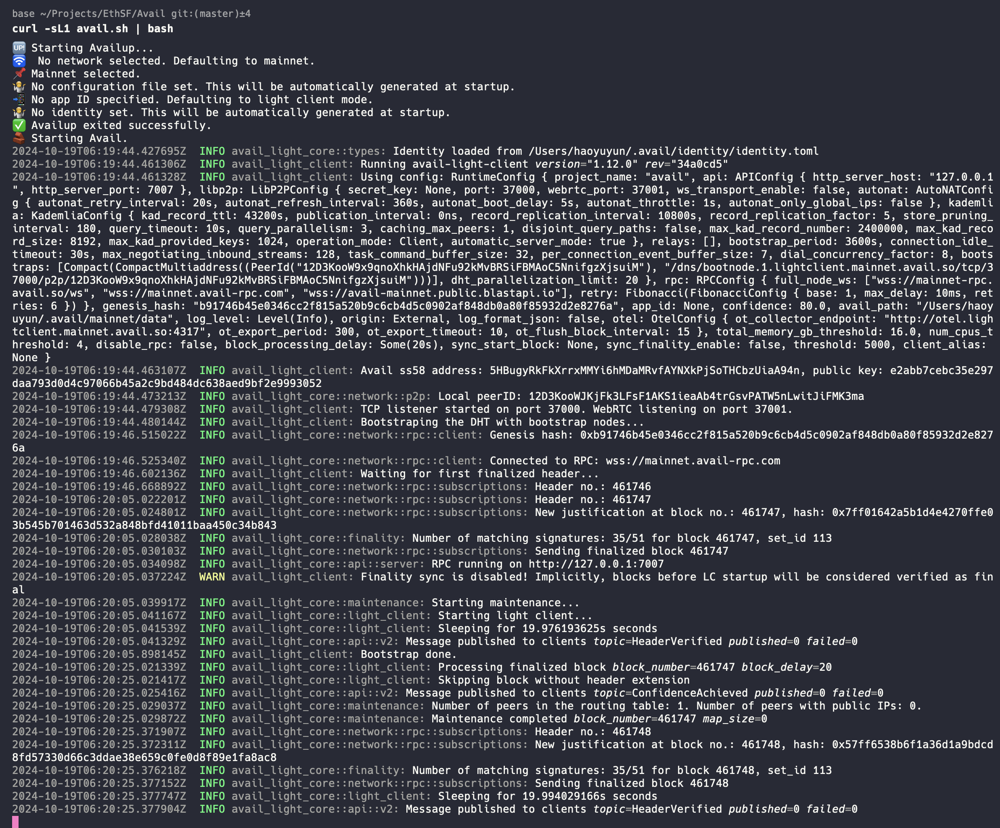
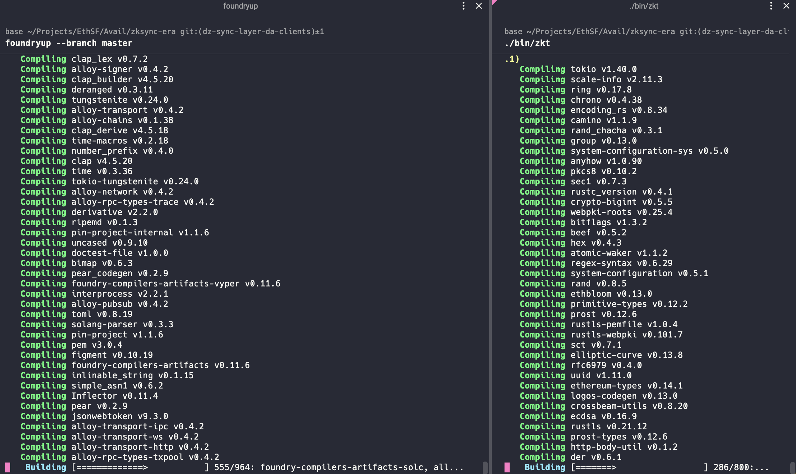
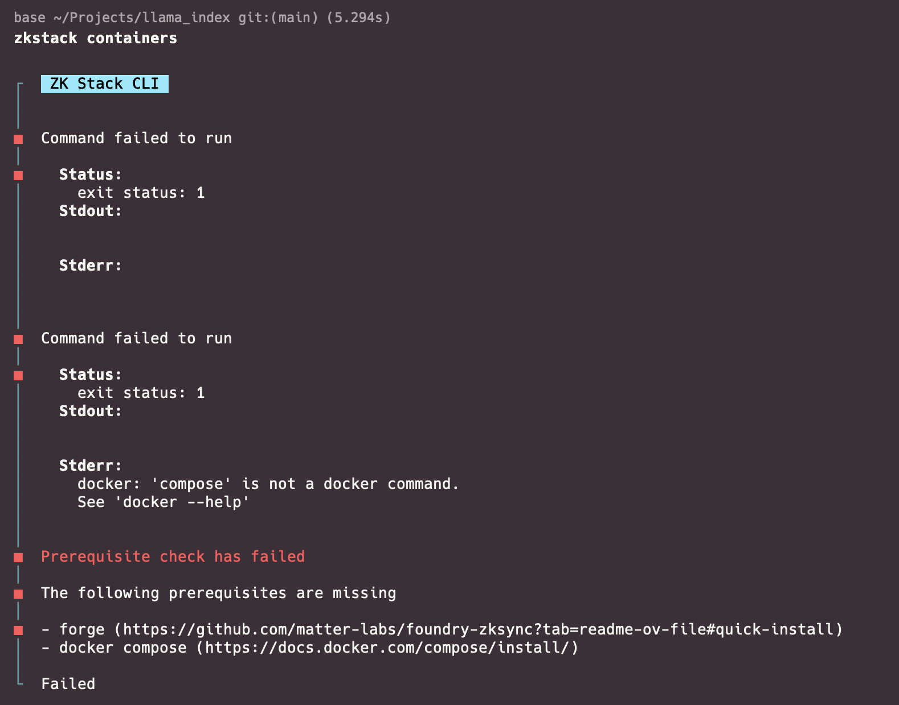
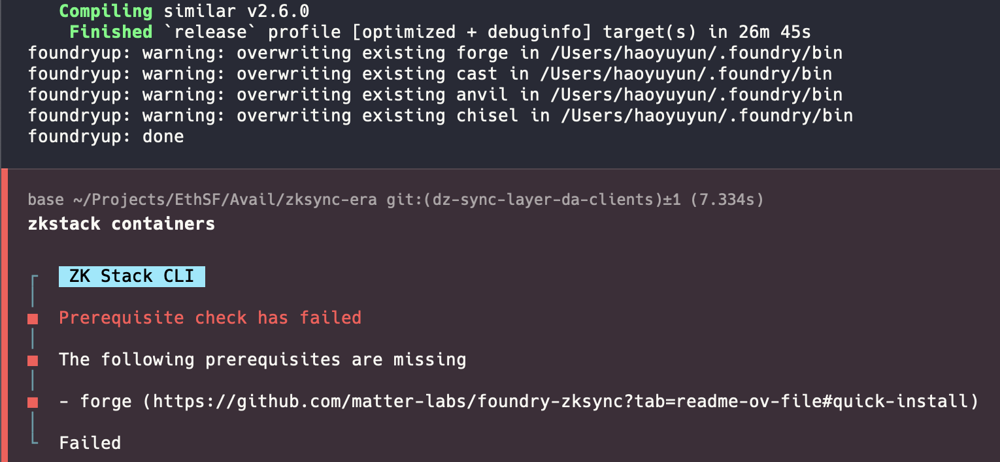

<!-- 📝 Test out the docs (Developer Feedback) ⸺ $1,000
Split evenly between all qualifying projects
This is a special bounty for EthSF builders!
We want YOU, hackers, to test our docs. These docs have been written for a long time, and we want an honest feedback!
You have to perform ANY of the tasks below and give your feedback for this in a .md file and a github repo with images of testing.
* Test out OP stack end-to-end
* Test out ZK stack end-to-end
* Test out Arbitrum Orbit end-to-end
* Test out avail-js, avail-go, avail-deno, and avail-rust
* Any other examples and feedback on the docs
Qualification Requirements
Hackers need to:
1. Go through the documentation of Avail
2. Test out by running any of the category for documentation
3. Create a feedback.md file in your existing Project repo or create a new Github repo and provide the feedback in it.
4. Upload the screenshots of running the stacks in the same repo. -->

Start: 22:28

# Getting started
https://docs.availproject.org/docs/build-with-avail/quickstart

- Avail light client command works


# Test out ZK Stack

## Setting up dev environment
- This is a decent compressed version of https://github.com/matter-labs/zksync-era/blob/main/docs/guides/setup-dev.md

- Why are each of these prereqs required?
- The prereq table <> commands parity
    - no Rust in prereq table
    - match ordering of prereq table + commands
- Include installation instructions for Mac OS
- Cloning instructions are duplicated for the commands and "Step 2"

Mac OS versions:
```
# Rust
curl --proto '=https' --tlsv1.2 -sSf https://sh.rustup.rs | sh

# NVM
curl -o- https://raw.githubusercontent.com/nvm-sh/nvm/v0.39.5/install.sh | bash

# All necessary stuff (install Xcode command line tools and Homebrew packages)
xcode-select --install
/bin/bash -c "$(curl -fsSL https://raw.githubusercontent.com/Homebrew/install/HEAD/install.sh)"
brew install cmake llvm openssl@1.1 postgresql@14 curl

# Install Docker
# Download and install Docker Desktop from: https://www.docker.com/products/docker-desktop/
# Ensure Docker Desktop is started

# Stop default postgres (as we'll use the docker one)
brew services stop postgresql

# Node & yarn
nvm install 20
# Important: there will be a note in the output to load
# new paths in your local session, either run it or reload the terminal.
npm install -g yarn
yarn set version 1.22.19

# For running unit tests
cargo install cargo-nextest

# SQL tools
cargo install sqlx-cli --version 0.8.1

# Foundry
curl -L https://foundry.paradigm.xyz | bash
foundryup --branch master  # takes quite a while
```

[Aside: encountering ETH SF venue internet slowness]


## Installing & running the ZK Stack

### 1. Installing zkstack
- the command here takes quite a while

- we could include a sanity check command
- eg
```
$ zkstack --version
zkstack v0.1.0-650361ae
Branch: master
Submodules:
  - contracts: 84d5e3716f645909e8144c7d50af9dd6dd9ded62
Build timestamp: 2024-10-18 22:59:06
```

### 2. Clone the zksync-era repository from github:

- Why are we installing submodules from one branch, then checking out another?

- Also we need to `cd ..` to get back to repo root

### 3. Add custom chain logic


- What does `./bin/zkt` do?

### 4. Running the containers

Ah seems I missed a few installs


claims that forge is missing


but `$ which forge` gives us a path as expected

### 5. Initialize Elastic Chain ecosystem

stuck on the above step

### 6. Run ZK chain
